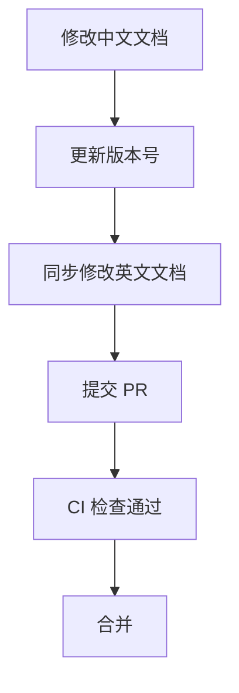

# CircleSeeker 双语文档维护指南

本指南定义 CircleSeeker 项目的双语文档维护策略和流程。

---

## 1. 双语文档概览

### 当前双语文档对照表

| 中文文档 | 英文文档 | 状态 |
|----------|----------|------|
| `CLI_Reference.md` | `CLI_Reference_en.md` | ✅ 同步 |
| `Pipeline_Modules.md` | `Pipeline_Modules_en.md` | ✅ 同步 |
| `Simulation_Validation.md` | `Simulation_Validation_en.md` | ✅ 同步 |
| `Configuration_Reference.md` | `Configuration_Reference_en.md` | ✅ 同步 |
| `Output_Format_Reference.md` | `Output_Format_Reference_en.md` | ✅ 同步 |

### 仅单语言文档

| 文档 | 语言 | 说明 |
|------|------|------|
| `UMC_Classification_Model.md` | 中文 | 内部技术文档，暂不需翻译 |
| `eccDNA_Evolutionary_Dynamics_Hypothesis.md` | 中文 | 研究假说文档，暂不需翻译 |
| `Code_Review_Report_v0.10.0.md` | 中文 | 版本审阅报告，内部使用 |
| `Implementation_Plan.md` | 中文 | 实施计划，内部使用 |

---

## 2. 维护策略

### 2.1 主要原则

1. **中文优先**：核心用户文档以中文为主版本
2. **同步更新**：修改中文文档后，必须同步更新英文版本
3. **版本标记**：文档头部应包含版本号，便于追踪同步状态
4. **最小化翻译**：技术术语、代码示例、配置项保持原样

### 2.2 文档分类

| 类别 | 需要双语 | 示例 |
|------|----------|------|
| **用户指南** | ✅ 是 | CLI 参考、配置参考、输出格式 |
| **技术规范** | ✅ 是 | 管道模块说明 |
| **验证报告** | ✅ 是 | 仿真验证报告 |
| **内部文档** | ❌ 否 | 审阅报告、实施计划 |
| **研究文档** | ⚪ 可选 | 分类模型、假说文档 |

---

## 3. 更新流程

### 3.1 修改现有双语文档



**步骤**：

1. 修改中文版本 `docs/XXX.md`
2. 更新文档顶部的版本号（如有）
3. 同步修改英文版本 `docs/XXX_en.md`
4. 在 commit message 中标注：`docs: update XXX (zh/en)`
5. 提交 PR，等待 CI 检查

### 3.2 新增双语文档

1. 创建中文版本 `docs/NewDoc.md`
2. 创建英文版本 `docs/NewDoc_en.md`
3. 更新本指南的文档对照表
4. 在 `docs/source/index.rst` 中添加链接（如使用 Sphinx）

### 3.3 紧急修复

如仅需快速修复单一语言版本的错误：

1. 修复目标语言版本
2. 创建跟踪 Issue，标记需要同步另一语言
3. 在后续 PR 中完成同步

---

## 4. CI 自动化检查

### 4.1 文档同步检查

CI 会自动检查双语文档的同步状态：

```yaml
# .github/workflows/ci.yml 中的 docs-sync-check job
docs-sync-check:
  name: Documentation sync check
  runs-on: ubuntu-latest
  steps:
    - uses: actions/checkout@v4
    - name: Check bilingual docs sync
      run: |
        python scripts/check_docs_sync.py
```

### 4.2 检查脚本逻辑

`scripts/check_docs_sync.py` 检查：

1. 每个中文文档是否有对应的英文版本
2. 文件修改时间是否相近（容差 7 天）
3. 输出不同步的文档列表

### 4.3 检查结果处理

| 情况 | 行为 |
|------|------|
| 所有文档同步 | ✅ 检查通过 |
| 存在不同步文档 | ⚠️ 警告（不阻塞合并） |
| 缺少英文版本 | ❌ 失败（阻塞合并） |

---

## 5. 翻译指南

### 5.1 术语对照表

| 中文 | 英文 | 说明 |
|------|------|------|
| 串联重复 | tandem repeat | - |
| 环状 DNA | circular DNA / eccDNA | - |
| 确认的 | Confirmed | eccDNA 状态 |
| 推断的 | Inferred | eccDNA 状态 |
| 片段 | segment | CeccDNA 组成部分 |
| 命中 | hit | 比对结果 |
| 位点 | locus | 基因组位置 |
| 覆盖率 | coverage | - |
| 检查点 | checkpoint | 运行恢复点 |

### 5.2 格式保持

- **代码块**：保持不变
- **配置示例**：保持不变
- **文件路径**：保持不变
- **命令行示例**：保持不变
- **表格结构**：保持一致

### 5.3 翻译质量要求

1. 准确传达技术含义
2. 句式符合目标语言习惯
3. 保持专业术语一致性
4. 避免机械翻译痕迹

---

## 6. 工具推荐

### 6.1 翻译辅助

- **DeepL**：高质量机器翻译初稿
- **Google Translate**：术语查询参考
- **专业词典**：生物信息学术语标准化

### 6.2 文档比对

- **Meld**：图形化文件比对工具
- **diff**：命令行比对
- **VS Code**：并排编辑双语文档

### 6.3 版本控制

```bash
# 查看文档修改历史
git log --oneline docs/CLI_Reference.md docs/CLI_Reference_en.md

# 比较两个版本
git diff HEAD~5 docs/CLI_Reference.md
```

---

## 7. 常见问题

### Q1: 是否所有文档都需要双语？

**答**：不是。用户面向文档需要双语，内部开发文档可以仅保留中文。

### Q2: 英文版本可以落后中文版本吗？

**答**：短期内可以（不超过一个版本周期），但需要创建跟踪 Issue。

### Q3: 发现翻译错误如何处理？

**答**：直接提交修复 PR，标注 `docs: fix translation in XXX_en.md`。

### Q4: 如何处理大量新增内容？

**答**：
1. 先完成中文版本并合并
2. 创建翻译 Issue
3. 在下一个 PR 中完成英文翻译

---

## 8. 相关资源

- [Sphinx 文档系统](https://www.sphinx-doc.org/)
- [MyST Parser](https://myst-parser.readthedocs.io/) - Markdown 支持
- [Read the Docs](https://readthedocs.org/) - 文档托管
